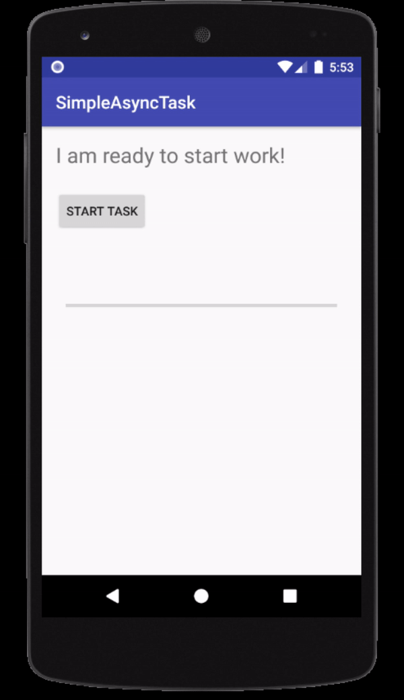

# AAD_1072_HW07

Please follow the instructions on the **Homework** sections in these codelabs.

- [07.1: AsyncTask](https://codelabs.developers.google.com/codelabs/android-training-create-asynctask/index.html?index=..%2F..%2Fandroid-training#9)
- [07.2: AsyncTask and AsyncTaskLoader](https://codelabs.developers.google.com/codelabs/android-training-asynctask-asynctaskloader/index.html?index=..%2F..%2Fandroid-training#10)
- [07.3: Broadcast receivers](https://codelabs.developers.google.com/codelabs/android-training-broadcast-receivers/index.html?index=..%2F..%2Fandroid-training#9)

## Part 1. Questions (20 pt)

| Codelab | Questions |
| --- | ----------- |
| 07.1 | 4 Questions |
| 07.2 | 7 Questions |
| 07.3 | 4 Questions |

## Part 2. Android Tests (70 pt)

Please submit your code to the **master** branch in this repository for grading.

**[Notice]** 
- Please do not modify the following files:
    - .travis.yml
    - <Project>/app/src/androidTest/*
    - gradle files
- Once any modifications or any cheating behavior are detected, you will got 0 pt for this homework.
- Creating a new branch to develop and testing locally are highly recommended.
    
<table>
    <thead>
        <tr>
            <th>Codelab</th>
            <th>Starter Project</th>
            <th>Test File</th>
            <th>Questions</th>
            <th>Points</th>
        </tr>
    </thead>
    <tbody>
        <tr>
            <td>07.1</td>
            <td>SimpleAsyncTask</td>
            <td>ProgressBarTest</td>
            <td>testProgressBarLayout</td>
            <td>10 pt</td>
        </tr>
        <tr>
            <td rowspan=3>07.2</td>
            <td rowspan=3>GetWebSourceCode</td>
            <td rowspan=2>GetWebSourceCodeTest</td>
            <td>testWebSourceCodeLayout</td>
            <td>10 pt</td>
        </tr>
        <tr>
            <td>testWebSourceCodeFunction</td>
            <td>20 pt</td>
        </tr>
        <tr>
            <td>NoInternetTest</td>
            <td>testNoInternetResponse</td>
            <td>10 pt</td>
        </tr>
        <tr>
            <td rowspan=2>07.3</td>
            <td rowspan=2>PowerReceiver</td>
            <td rowspan=2>CustomBroadcastTest</td>
            <td>testRangeOfRandomNumber</td>
            <td>10 pt</td>
        </tr>
        <tr>
            <td>testToastMessage</td>
            <td>10 pt</td>
        </tr>
    </tbody>
</table>

----
## Part 3. ScreenShots and descriptions (10 pt)

Please upload your screenshots in this repo **with specific file name in "screenshots" folder**.
Make sure your screenshots including the following components.

- [免費線上影片轉 GIF 動圖教學](https://www.kocpc.com.tw/archives/225214)
- [EZGIF - online GIF maker and image editor](https://ezgif.com/)

| Codelab | Questions | Points |
| --- | ----------- | ---|
| 07.1 |  A ProgressBar that displays the percentage of sleep time complete    | 10 pt |

### Question 1.1 - How do you determine the range of values that a ProgressBar can show?

Using for loop the let index i from 0 to increase until reach the maximum value s, in every loop calculate (i/s)X100, the range will be from 0 to 100.

### Question 1.2 - How do you change how much of the progress bar is filled in?

In the for loop execute publishProgress to pass the progress-bar value to the onProgressUpdate, in which we update the value of progress-bar.

### References:  
[ProgressBar in AsyncTask](https://android--examples.blogspot.com/2017/02/android-asynctask-with-progress-bar.html)